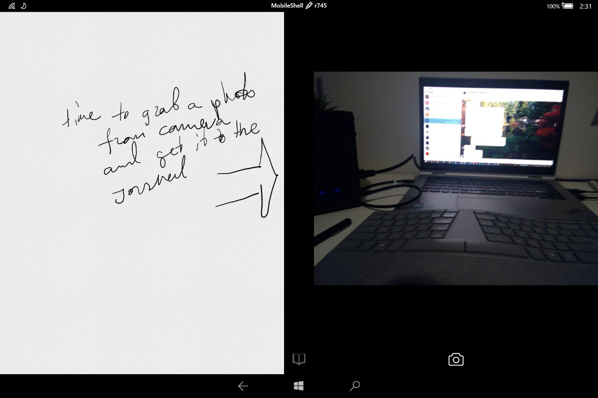

# CourierShell - A custom shell for Windows 10 Desktop on Tablets (18632+)

### Running on a Tablet (Surface Go):

## What's new:

- See MobileShell updates in main repository here: <https://github.com/ADeltaX/MobileShell>

## UI Architecture:

- Shell

- - Apps
  - - Settings
  - Journals (Infinite Zoomable Canvas with Journals)
  - Journal (Infinite Journal with pages)
  - Camera
  - Gallery
  - Web

## Challenges & Proposed Mitigations:

 - Experiences

    - Web

       - Open web browser - how can we support opening browser on another side? One idea - use UWP's WebView control
       - Passwords?
       - Multiple Tabs 
     - Camera
        - Auto get & set max resolution - done
        - Auto get & use rear camera - done
        - How to swap camera?
        - How to capture image? - done
        - and put to clipboard?
        - Drag-n-drop from Camera?
        - Switch to gallery?
    - Gallery
       - Drag-n-drop from Gallery?
    - Journal
       - How to have two pages of the same Journal open at the same time? - done
 - Actions
   - Paste from Clipboard - how to make it the most intuitive thing in the world? Watch Clipboard in UWP APIs?
   - Search - use Ink Analysis from Vista times to transform ink into text, and then use Lucene.Net for full-text search?

- General UI
    - Context Menu - re-use one from SyncFusion or build our own?
- Gestures
    - How to get back to all apps on both sides? 3 fingers?
    - How to zoom out from Journal pages? 2 fingers pinch-n-zoom?
    - How to switch an app in one of the sides? 2 fingers?

## License

For now, this project is licensed under the MIT License - see the LICENSE.md file for details
